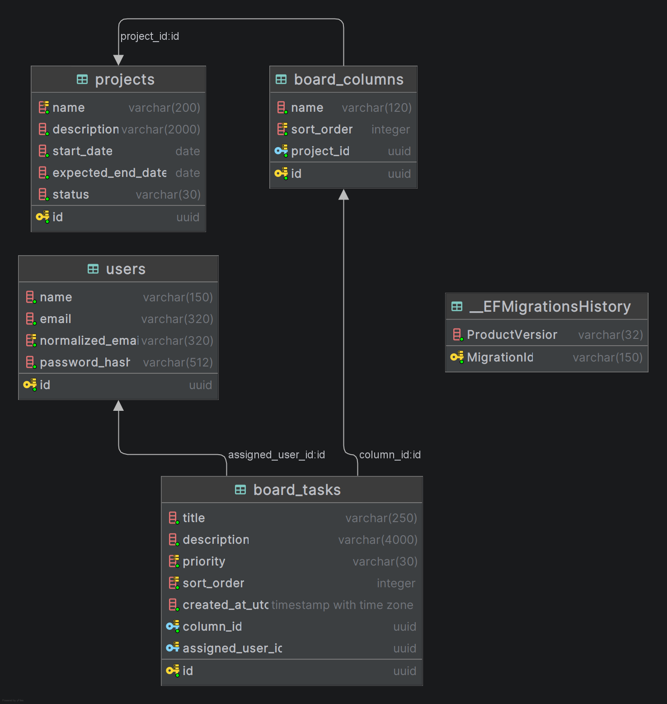

# ScrumBoard

ScrumBoard es una aplicación web para gestionar proyectos ágiles mediante tableros Kanban configurables. Permite administrar proyectos, columnas y tareas, persistir el orden por arrastre, sincronizar cambios entre sesiones en tiempo real y exportar reportes del proyecto en PDF y Excel.

- **Repositorio público:** [GitHub](https://github.com/daburneo1/scrum_board)
- **Video demostrativo:** [YouTube](https://youtu.be/pcRrvI9VcfU)

## Stack

| Componente | Tecnología |
|---|---|
| Frontend | Angular 17, TypeScript, SCSS, PrimeNG 17 y plantilla Sakai |
| Backend | .NET 8, C# y ASP.NET Core Web API |
| Persistencia | Entity Framework Core con migraciones incrementales |
| Base de datos | PostgreSQL |
| Autenticación | JWT Bearer |
| Tiempo real | ASP.NET Core SignalR |
| Reporte PDF | QuestPDF |
| Reporte Excel | EPPlus 8.6.3 |
| Contenedores | Docker y Docker Compose |
| Pruebas | NUnit en backend, Karma/Jasmine en frontend |

## Funcionalidades implementadas

- Inicio de sesión con JWT y dos usuarios precargados por migración.
- Endpoints de negocio protegidos con autorización.
- Guardia de rutas e interceptor HTTP en Angular.
- CRUD de proyectos desde API e interfaz.
- Listado de proyectos con paginación y filtro parcial por nombre en servidor.
- Administración de columnas del tablero, incluida reordenación.
- Regla backend que impide eliminar columnas con tareas.
- CRUD de tareas desde el tablero, con responsable y prioridad.
- Tablero Kanban dinámico con drag-and-drop entre columnas y dentro de la misma columna.
- Persistencia del orden de columnas y tareas.
- Actualización optimista con reversión visible si el servidor rechaza el movimiento.
- Sincronización en tiempo real con SignalR por tablero.
- Cierre de conexión y suscripciones al destruir el componente del tablero.
- Reportes PDF y Excel generados desde el mismo DTO; cada solicitud de exportación obtiene los datos mediante una única consulta.
- Descarga de reportes desde el frontend con nombre de archivo y tipo de contenido.
- Funcionalidades opcionales: filtros por responsable/prioridad, búsqueda de tareas e indicador de usuarios conectados.

## Ejecución con Docker Compose

### Requisitos

- Git.
- Docker Desktop o Docker Engine.
- Docker Compose.

### 1. Clonar el repositorio

```bash
git clone https://github.com/daburneo1/scrum_board.git
cd scrum_board
```

### 2. Crear la configuración local

```bash
cp .env.example .env
```

El archivo `.env.example` incluye valores locales por defecto para levantar la solución rápidamente. El archivo `.env` no debe versionarse.

### 3. Levantar la solución

```bash
docker compose up --build --detach
```

El comando inicia:

- PostgreSQL.
- API .NET en `http://localhost:8080`.
- Frontend Angular servido con nginx en `http://localhost:4200`.

La API aplica las migraciones de Entity Framework Core al iniciar cuando `Database__ApplyMigrations=true`.

### 4. Verificar servicios

```bash
docker compose ps
```

También se puede validar la API con:

```bash
curl http://localhost:8080/health
```

### 5. Acceder a la aplicación

- Frontend: `http://localhost:4200`
- Health check API: `http://localhost:8080/health`

No se incluye Swagger en esta solución.

### Usuarios de prueba

| Usuario | Contraseña |
|---|---|
| `admin@scrumboard.local` | `Admin123!` |
| `user@scrumboard.local` | `User123!` |

### Detener la solución

```bash
docker compose down
```

Para eliminar también el volumen de PostgreSQL:

```bash
docker compose down --volumes
```

## Configuración

El backend toma la conexión a PostgreSQL y la clave JWT desde variables de entorno. En Docker Compose se definen explícitamente `POSTGRES_HOST`, `POSTGRES_PORT`, `POSTGRES_DB`, `POSTGRES_USER`, `POSTGRES_PASSWORD`, `JWT_KEY` y `Database__ApplyMigrations`.

El frontend usa archivos de entorno de Angular:

- Desarrollo: `src/environments/environment.ts`.
- Producción/Docker: `src/environments/environment.prod.ts`.

En Docker, nginx expone el frontend y proxy inverso hacia `/api`, `/health` y `/hubs`, evitando direcciones de servicio embebidas en componentes.

## Arquitectura

### Backend

El backend sigue arquitectura hexagonal:

- `Domain`: entidades, enumeraciones y validaciones propias del dominio.
- `Application`: casos de uso, contratos, DTOs, puertos y lógica de aplicación.
- `Infrastructure`: Entity Framework Core, PostgreSQL, hashing de contraseñas, JWT y exportadores.
- `WebApi`: controllers REST, middleware, autorización, health check y hub SignalR.

La regla de dependencias mantiene el dominio y la aplicación independientes de detalles externos. Los adaptadores se conectan mediante puertos como repositorios, servicios de seguridad y exportadores.

### Frontend

El frontend está organizado por funcionalidades:

- `core/auth`: sesión, guardia, interceptor y almacenamiento del token.
- `features/auth`: login.
- `features/projects`: listado de proyectos, tablero, servicios REST, SignalR y reportes.
- `layout`: plantilla Sakai y navegación.

Los componentes coordinan la interacción de usuario; los servicios encapsulan comunicación HTTP, SignalR y descarga de archivos.

## Modelo de base de datos

El modelo se construye con migraciones incrementales de Entity Framework Core.



Relaciones principales:

- Un proyecto contiene varias columnas.
- Una columna pertenece a un proyecto y contiene varias tareas.
- Una tarea pertenece a una columna.
- Una tarea puede tener un usuario responsable.
- Al eliminar un usuario, sus tareas quedan sin responsable.
- No se permite eliminar una columna con tareas.

Migraciones incluidas:

- `20260731060010_InitialSchema`: esquema inicial.
- `20260801054142_SeedInitialUsers`: usuarios iniciales.
- `20260802024335_RestrictColumnDeletionWithTasks`: restricción para proteger columnas con tareas.

## Autenticación y seguridad

Las contraseñas se almacenan con hash usando `PasswordHasher<TUser>` de ASP.NET Core Identity, que incluye salt. Tras validar credenciales, la API emite un JWT firmado. Los endpoints de negocio y el hub de SignalR requieren autenticación.

El canal de tiempo real usa el mismo token de sesión mediante `accessTokenFactory` en Angular y validación JWT en ASP.NET Core.

Para el alcance de la prueba, el frontend almacena el token en `localStorage`. En producción convendría evaluar cookies seguras o un Backend for Frontend según el modelo de despliegue.

## Estrategia de ordenamiento

Columnas y tareas guardan un `sort_order` entero. La solución usa valores espaciados (`1000`, `2000`, `3000`, ...) y el backend recalcula el orden canónico de los elementos afectados al mover o reordenar.

El frontend envía la intención del movimiento; el backend valida columnas, índices y pertenencia de la tarea antes de persistir. Esta estrategia es simple, determinista y suficiente para el volumen esperado del reto.

Alternativas consideradas:

- Índices consecutivos: simple, pero requiere más actualizaciones.
- Posiciones decimales: reduce actualizaciones, pero acumula problemas de precisión/normalización.
- LexoRank: útil en alta concurrencia y gran escala, pero innecesario para este alcance.

## Sincronización en tiempo real

Se eligió SignalR porque integra autenticación JWT, reconexión automática y grupos por tablero sin implementar WebSocket manualmente.

Cada sesión se une al grupo del proyecto activo. Los cambios de tareas se publican solo a ese grupo, por lo que una sesión no recibe eventos de tableros a los que no está suscrita. Al recibir un evento, el frontend vuelve a consultar el estado del tablero porque REST y PostgreSQL son la fuente de verdad.

Alternativas descartadas:

- WebSocket manual: más control, pero mayor complejidad para autenticación, grupos y reconexión.
- Server-Sent Events: suficiente para eventos unidireccionales, pero menos flexible para este caso.
- Polling: simple, pero genera tráfico periódico y no cumple tan bien el requisito de actualización inmediata.

Limitación conocida: la presencia de usuarios está en memoria. Para múltiples instancias de API se requeriría un backplane o almacenamiento distribuido.

## Reportes PDF y Excel

Ambos formatos se generan desde `ProjectReportDto`. Cada solicitud de exportación ejecuta una única consulta proyectada mediante `ProjectReportRepository`, y entrega el resultado al exportador correspondiente.

- `QuestPdfProjectReportExporter`: genera PDF.
- `EpPlusProjectReportExporter`: genera Excel.

Agregar un tercer formato implica crear otro exportador que implemente el contrato y registrarlo en inyección de dependencias, sin modificar los exportadores existentes.

Los reportes incluyen datos del proyecto, fecha de generación, filtros aplicados y tabla de tareas con columna, responsable y prioridad.

## Pruebas y validación

- Backend: 12 pruebas aprobadas.
- Frontend: 9 pruebas aprobadas.

Backend:

```bash
cd backend/wsScrumBoard
dotnet restore
dotnet build
dotnet test
```

Frontend:

```bash
cd frontend/appWebScrumBoard
npm ci
npm run build
npm test -- --watch=false --browsers=ChromeHeadless
```

Las pruebas cubren lógica de aplicación, presencia de usuarios y cálculo de nueva posición de tareas al reordenar.

## Decisiones y limitaciones

- Sakai y PrimeNG se usan para acelerar una interfaz consistente sin desarrollar componentes base desde cero.
- No se incorporó gestor global de estado; servicios con RxJS son suficientes para el alcance.
- REST y PostgreSQL son la fuente de verdad; SignalR actúa como canal de notificación.
- Los filtros y la búsqueda se procesan en el servidor y se reutilizan al generar los reportes, evitando diferencias entre la vista del tablero y el archivo exportado.
- El reordenamiento se deshabilita mientras existen filtros activos, porque la posición visible de una tarea filtrada no necesariamente representa su índice dentro del conjunto completo.
- La presencia se mantiene en memoria y cuenta usuarios autenticados distintos, no conexiones; varias pestañas del mismo usuario cuentan como una sola presencia.

## Uso de asistentes de inteligencia artificial

Durante el desarrollo se utilizaron las siguientes herramientas de OpenAI:

### ChatGPT

Se utilizó como apoyo para:

- Planificación y distribución del trabajo.
- Análisis de alternativas arquitectónicas.
- Revisión de decisiones técnicas.
- Elaboración de escenarios de prueba.
- Resolución de dudas de implementación.
- Preparación de documentación y del README.

### Codex

Se utilizó dentro del entorno de desarrollo para:

- Explorar la estructura de las soluciones.
- Proponer e implementar cambios localizados.
- Generar y ajustar código.
- Crear y revisar pruebas.
- Detectar errores de compilación.
- Apoyar refactorizaciones y validaciones técnicas.

El uso de estas herramientas fue asistivo. Todo código incorporado fue revisado, adaptado a la estructura real del proyecto, compilado y validado por el autor.

Las decisiones finales, la integración de los cambios y la sustentación técnica son responsabilidad del autor.
## Autor

David Alejandro Burneo Valencia
